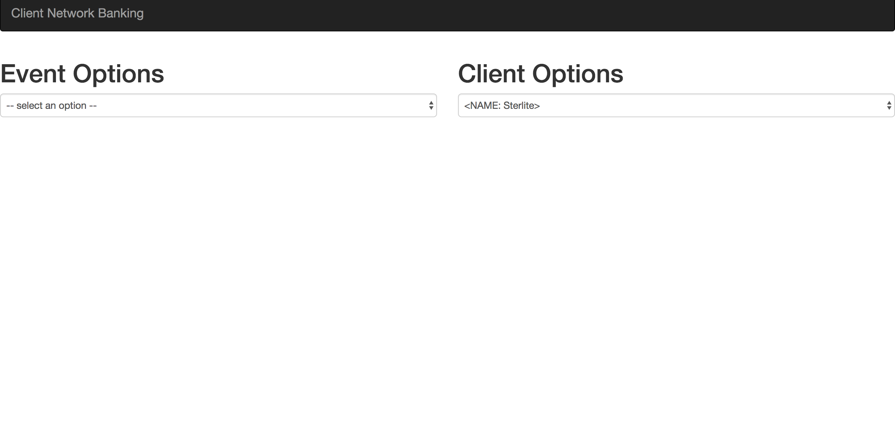

*阅读本文的其他语言版本：[English](README.md)。*

# 利用IBM NLU Studio进行银行风险缓释
> 风险缓释 释义详见： [风险缓释(via. baike.baidu.com)](https://baike.baidu.com/item/%E9%A3%8E%E9%99%A9%E7%BC%93%E9%87%8A/2266828?fr=aladdin)

在当今动态市场的环境下，对客户的全方位视角是投资介词风险缓释的关键要素。了解客户是一种必要的最佳实践，因为它可以作为决定是否投资某一特定客户的基础。 为了让客户关系经理成功地做出正确的决定，他们必须在适当、准确和及时的信息上操作。

如果我们可以构建一个工具来帮助你收集关于你的客户的所有必要信息。帮助你做出明智的决定是否要投资一个客户？

这段代码模式是一种数据科学驱动的解决方案，它使用机器学习来构建客户关联网络的知识图，并从开源可用的数据中获取相关事件，对这些进行多维度关联以获得洞察力。

假设，有一个投资者想要关于客户投资的建议或者甚至是了解一个现有客户的情况。这个应用程序在[Watson Natural Language Understanding](https://console.bluemix.net/catalog/services/natural-language-understanding)的帮助下提供了与一个组织有关的实时趋势信息，并从流行的新闻站点中提取受影响的客户。它是在以下的代码原型基础上实现的：
* [Augmented Classification of text with Watson Natural Language Understanding and IBM Data Science experience](https://developer.ibm.com/code/patterns/extend-watson-text-classification)

所提取的信息符合影响任何组织的最重要事件。The information extracted is in compliance with the most important events impacting any organization.  
这些示范事件为-
* 变更管理
* 违约管理
* 信用等级
* 罢工
* 股价偏离

最后，一个Flask应用程序(Flask is a microframework for Python)
将这个算法连接到一个UI，并使所有这些信息都可以在一个单独的地方进行整理。因此，可以帮助客户关系经理了解当前的客户网络，并为投资者提供正确的建议。


## 流程

1. 用户与应用程序UI进行交互，以请求与事件或客户对应的相关信息。
2. Web应用程序UI与python-Flask服务器交互，以从适当的API接收所需的信息。
3. 利用Flask api从流行的在线新闻门户网站抓取实时新闻。
4. 这些被抓取的数据被发送到沃森自然语言的理解(Watson NLU)中去提取重要的实体。
5. 一个JSON配置文件被发送到Flask应用程序中，进一步减少在沃森自然语言理解上获得的结果。
6. 最后，所有收集到的信息都被推送回交互式UI界面。


## 包含的组件

* [Watson Natural Language Understanding](https://console.bluemix.net/catalog/services/natural-language-understanding)： 一个IBM云服务，使用NLU可以分析文本从概念、实体、关键字、类别、情绪、情感、关系、语义角色等内容中提取元数据。
* [Python Runtime](https://console.bluemix.net/docs/runtimes/python/index.html#python_runtime)： IBM Cloud 
通过`python_buildpack`支持Python运行。`python_buildpack`为Python2 和 Python3 提供了完整的运行环境。 

## 特色技术

* [Natural Language Processing](https://www.ibm.com/watson/services/natural-language-understanding)：自然语言处理
(NLP)是一个涵盖了计算机理解和操作人类语言的领域，新闻采集的可能性已经趋于成熟。
* [Cloud](https://www.ibm.com/developerworks/learn/cloud/)：通过互联网访问计算机和信息技术资源。
* [Python](https://www.python.org/)：Python是一种编程语言，它可以让您更快地工作，并更有效地集成您的系统。
* [Artificial Intelligence](https://www.ibm.com/services/artificial-intelligence)：人工智能是机器所展示的智能，与人类和其他动物所展示的自然智能形成对比。

## 观看视频
[](http://www.youtube.com/watch?v=B_NDyeqEn2k)

## 先决条件
如果下面列表还没有安装在你的PC系统上，请根据自己的系统规范依据link中内容进行安装。

* [Python](https://www.python.org/downloads/)：该应用程序是在`ython3.6`上构建的，为了能够正常运行应用程序`Python 3.x`版本是首选。
* [Git](https://git-scm.com/downloads)： 克隆仓库，另一种选择是你可以使用`Clone or Download`按钮。
* [IBM Cloud account](https://console.bluemix.net/registration/?target=%2Fdashboard%2Fapps)： 访问IBM 云服务 和 Watson 服务。
* [IBM Cloud CLI](https://console.bluemix.net/docs/cli)： 上传Python程序到你的IBM云组织。


运行这个应用程序有两种方法，根据您的需求，您可以选择以下列任何一种方式运行：
* [在IBM Cloud上运行](#3-setup-the-application-on-ibm-cloud)：这将允许您在代码中做出想要的更改，然后将应用程序推到您的IBM Cloud Foundry组织。
* [本地运行](#4-setup-the-application-on-your-localhost)：这将向您展示如何使用提供的Flask Server在本地、笔记本/桌面上运行应用程序。


## 步骤
1. [克隆仓库](#1-clone-the-repo)
2. [创建IBM云服务](#2-create-ibm-cloud-service)
3. [在IBM Cloud上进行配置](#3-setup-the-application-on-ibm-cloud)
4. [在本地进行配置](#4-setup-the-application-on-your-localhost)
5. [运行Python程序](#5-running-the-python-application)

## 1. 克隆仓库

现在，你已经准备好开始使用该应用程序了。克隆仓库并切换到示例应用所在的目录。
  ```
git clone git@github.com:IBM/banking-risk-mitigation-nlu-studio.git
cd banking-risk-mitigation-nlu-studio
  ```
  
## 2. 创建IBM云服务

创建以下的IBM云服务。命名为：`Bankingriskmitigation`。选择你想要的区域、组织和空间。

  * [**Watson Natural Language Understanding**](https://console.bluemix.net/catalog/services/natural-language-understanding)

  
  
  如果你希望更改NLU服务实例的名称，请确保在`manifest.yml`中更新服务名称。
  

## 3. 在IBM Cloud上进行配置

你可以利用[IBM Cloud CLI](https://console.bluemix.net/docs/cli)上传app到IBM Cloud。这将使用`manifest.yml`文件中的服务和程序名称。从克隆git仓库的根目录，使用CLI登录到IBM Cloud：
```
ibmcloud login
```

`注意：确保你在相同的区域、组织和空间，就像上面所创建的Watson NLU服务一样。`

交互式的到达Cloud Foundry 组织/空间。

```
ibmcloud target --cf
```

最后上传app到IBM Cloud:
```
ibmcloud cf push Client_Network_Banking_V1
```

`注意：如果您希望更改此应用程序的名称 - 导航到'manifest.yml'文件并更新“name”字段。`

这一步可能需要几分钟才能完成。

一旦完成, 进入你的 [IBM Cloud Dashboard](https://console.bluemix.net/dashboard/apps)


点击你的应用程序，它会把你带到一个页面，如下所示：


点击 `Visit app URL`, 查看应用程序。

要理解如何使用应用程序，直接导航到 [步骤 5](#5-running-the-python-application) 

## 4. 在本地进行配置

首先确保 [步骤 1](#1-clone-the-repo) 和 [步骤 2](#2-create-ibm-cloud-service) 已经完成。

### 更新NLU服务凭证

在你的[IBM Cloud Dashboard](https://console.bluemix.net/dashboard/services)打开Watson NLU服务并且点击NLU服务名`Bankingriskmitigation`。


一旦它在UI中打开，查看`凭证`菜单。复制`用户名`和`密码`键值，这些值出会现在UI中。


 
 * 导航到克隆的仓库并打开文件`app.py`。
 * 在代码中更新 `username` 和 `password` 键值对.
 
 
 
如果您希望更改NLU服务实例的名称，请确保在`manifest.yml`中更新服务名称。
  
### 启动程序

安装在[requirements.txt](https://pip.readthedocs.io/en/stable/user_guide/#requirements-files)中列出的依赖项以便能够在本地运行该应用程序。

  ```
pip install -r requirements.txt
  ```
为了避免这些依赖关系与其他Python项目或操作系统发生冲突，你可以按需的使用[virtual environment](https://packaging.python.org/installing/#creating-and-using-virtual-environments) 之后运行上述命令。

通过运行命令来安装`nltk`包依赖性。

```
python nltk_download.py
```

启动App
  ```
python app.py
  ```

在 http://localhost:8000 查看你的app。

要理解如何使用应用程序，查阅下面的步骤[Step](#5-running-the-python-application)

## 5. 运行Python 应用程序

这个应用程序提供了两种收集信息的方法：

* Event Options
* Client Options



用户可以点击任何事件触发点，在单击其中之一时，它会提供一个新闻条目列表和与之相关的客户。假设，我们点击`Share Price Deviation`，一个包含所有信息的表格，如下图所示：


如果我们点击客户，现在它将被过滤，只有那些有股价偏离的人：


如上图所示，如果我们点击任何一个客户。我们会得到一个新闻，在这个例子中，过滤掉-
* Share Price Deviation
* Bharath Electronics


因此，构建的应用程序使银行关系经理能够以更快、方便和统一的方式获取相关的客户生态系统新闻。

## 疑难解答

见 [Troubleshooting.md](TROUBLESHOOTING.md).

## 许可协议

[Apache 2.0](LICENSE)


