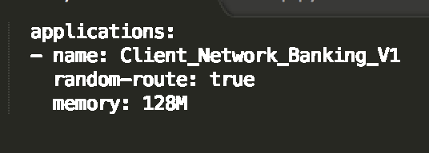

# Banking Risk Mitigation using NLU Studio

In the recent years, credit risk has become a big deal. While being rightly enraged about wilful defaulters who seem to be getting away with it, and asking for better lending practices for everyone, we fail to grasp the inherent complexity in the credit business. Knowing your Customer is an essential best practice because it is the foundation for all succeeding steps in the credit risk management process. To be successful, you must operate on pertinent, accurate, and timely information. The information you gather and the relationships you establish are critical for an organization investing in a numerous number of client. A poorly planned and executed initial call could limit your opportunity for future business. 

But how can we gather information to take the right decisions?

We can ask questions about the company’s products and services, customers, suppliers, facilities, management, ownership, and history. This is when you can develop your initial observations about management’s behavior and start to evaluate their qualifications and abilities to carry out the company’s business strategy. On subsequent calls, investigate competition, market share, and the probable impact of economic conditions on the business. And identify the company’s business strategy and what the company must do to succeed.

What if we can build a tool that can help you gather all the required information about your clients. To help you take an informed decision to whether or not to invest in a client?

This pattern provides real-time information regarding a client, known as a client-network, all collated in a single place. This information is in compliance to the most important events impacting any organization. The following are the event triggers in the built application: 
* Management Change
* Management Default
* Credit Rating
* Strike
* Share Price Deviation

This code pattern takes real-time information from popular news sites, extracts the clients affected by it with the help of [Watson Natural Language Understanding](https://console.bluemix.net/catalog/services/natural-language-understanding). This is acheived with the help of the following code patterns:
* [Augmented Classification of text with Watson Natural Language Understanding and IBM Data Science experience](https://developer.ibm.com/code/patterns/extend-watson-text-classification)
* [Correlation of text content across documents using Watson Natural Language Understanding, Python NLTK and IBM Data Science experience](https://developer.ibm.com/code/patterns/watson-document-correlation/)

Finally, a flask application connects the algorithm to a UI which can be used by a user to prune down to the required information.


## Flow

1. The user interacts with the app UI to request relevant information corresponding to an event or a client
2. The web app UI interacts with the Python-Flask server to receive the required information from the appropriate api.
3. The flask apis scrape real-time news from popular online news portals. 
4. The scraped data is sent to NLU Studio to extract important entities. 
5. A configuration json file is sent into the flask app, to further prune on the results obtained on NLU.
6. Finally, all the collected information is pushed back into the interactive UI.


## Included Components

* [Watson Natural Language Understanding](https://console.bluemix.net/catalog/services/natural-language-understanding): An IBM Cloud service that can analyze text to extract meta-data from content such as concepts, entities, keywords, categories, sentiment, emotion, relations, semantic roles, using natural language understanding.

## Featured Technologies

* [Natural Language Processing](https://www.ibm.com/watson/services/natural-language-understanding): Natural Language Processing is a field that covers computer understanding and manipulation of human language, and it’s ripe with possibilities for newsgathering.
* [Cloud](https://www.ibm.com/developerworks/learn/cloud/): Accessing computer and information technology resources through the Internet.
* [Python](https://www.python.org/): Python is a programming language that lets you work more quickly and integrate your systems more effectively.

# Deploy to IBM Cloud

Create an [IBM Cloud account](https://console.bluemix.net/registration/?target=%2Fdashboard%2Fapps) and directly deploy the application using the button below.

[](https://bluemix.net/deploy?repository=https://github.com/IBM/banking-risk-mitigation-nlu-studio)


# Watch the Video


## Prerequisite
* [Python](https://www.python.org/downloads/)
* [Git](https://git-scm.com/downloads)
* [IBM Cloud account](https://console.bluemix.net/registration/?target=%2Fdashboard%2Fapps)
* [IBM Cloud CLI](https://console.bluemix.net/docs/cli)

## Steps
1. [Clone the repo](#1-clone-the-repo)
2. [Create IBM Cloud service](#2-create-ibm-cloud-service)
3. [Update the NLU service credentials](#3-update-the-nlu-service-credentials)
4. [Run the Application locally](#4-run-the-application-locally)
5. [Run the Application on IBM Cloud](#5-run-the-application-on-ibm-cloud)
6. [Analyze the Results](#6-analyze-the-results)

## 1. Clone the repo

Now you're ready to start working with the app. Clone the repo and change to the directory where the sample app is located.
  ```
git clone https://github.com/IBM/banking-risk-mitigation-nlu-studio
cd banking-risk-mitigation-nlu-studio
  ```

  Peruse the files in the *get-started-python* directory to familiarize yourself with the contents.
  
## 2. Create IBM Cloud service

Create the following IBM Cloud service. Select the appropriate region, organization and space:

  * [**Watson Natural Language Understanding**](https://console.bluemix.net/catalog/services/natural-language-understanding)

  
  
## 3. Update the NLU service credentials

Open the Watson Natural Language Understanding service in your [IBM Cloud Dashboard](https://console.bluemix.net/dashboard/services) and click on your Natural Language Understanding service.

Once the service is open click the `Service Credentials` menu on the left.


In the `Service Credentials` that opens up in the UI, select whichever `Credentials` you would like to use in the notebook from the `KEY NAME` column. Click `View credentials` and copy `username` and `password` key values that appear on the UI in JSON format.


* Navigate to the cloned repo and open the file `app.py`.
* Go to the section in the code which declares `natural_language_understanding` instance.
* Update the `username` and `password` key values in the code.


## 4. Run the Application locally

Install the dependencies listed in the [requirements.txt](https://pip.readthedocs.io/en/stable/user_guide/#requirements-files) file to be able to run the app locally.

You can optionally use a [virtual environment](https://packaging.python.org/installing/#creating-and-using-virtual-environments) to avoid having these dependencies clash with those of other Python projects or your operating system.
  ```
pip install -r requirements.txt
  ```

Run the app.
  ```
python app.py
  ```

View your app at: http://localhost:8000


## 5. Run the Application on IBM Cloud

You can push the app to IBM Cloud using [IBM Cloud CLI](https://console.bluemix.net/docs/cli). This will use the services and application name in the `manifest.yml` file.  From your root directory login into IBM Cloud using CLI:
```
ibmcloud login
```
And push the app to IBM Cloud:
```
ibmcloud push Client_Network_Banking_V1
```

If you wish to change the name of the IBM Cloud application- Navigate to the `manifest.yml` file and update the `name` field.




# Troubleshooting

* To troubleshoot your IBM Cloud application, use the logs. To see the logs, run:

```bash
ibmcloud logs Client_Network_Banking_V1 --recent
```

# License

[Apache 2.0](LICENSE)


