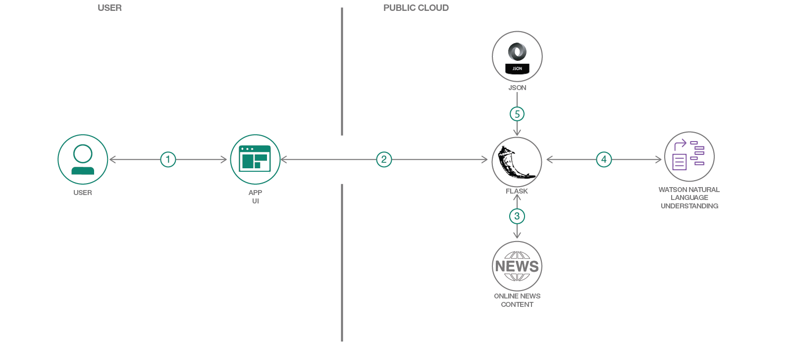
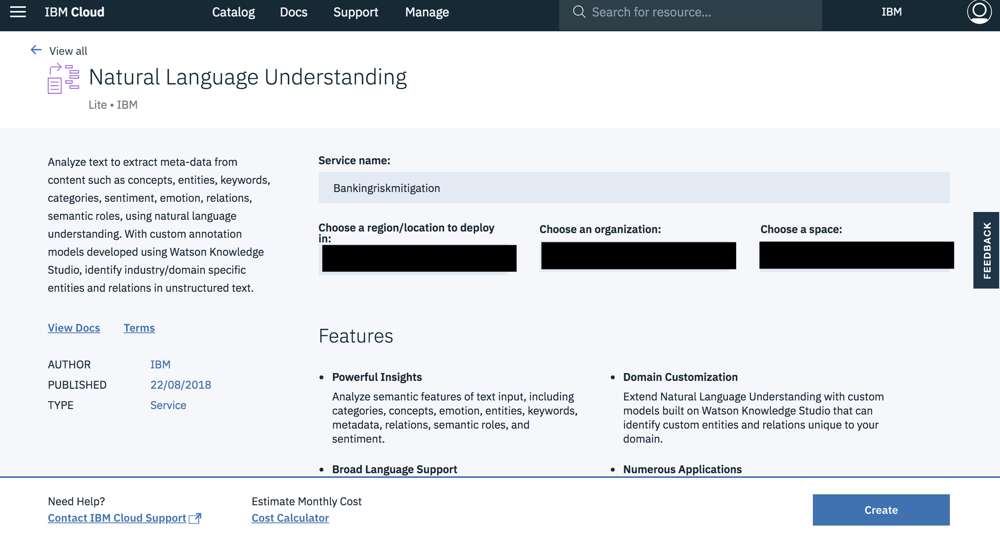
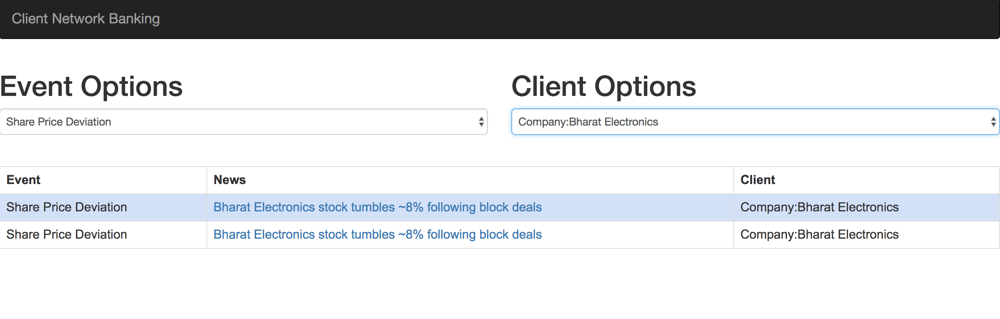

*Read this in other languages: [中文](README-cn.md).*

# Banking Risk Mitigation using NLU Studio

In today’s dynamic market environment, a 360-degree view of a client is a key factor for risk mitigation for investment prepositions. Knowing your client is an essential best practice because it acts as a basis to decide whether or not to invest in a particular client. For a customer relationship manager to be successful in taking the right decision, they must operate on pertinent, accurate, and timely information. 

What if we can build a tool that can help you gather all the required information about your clients. To help you make an informed decision on whether or not to invest in a client?

This code pattern is a data science driven solution that uses machine learning to build a knowledge graph of the client associations network and related events from data available as open source and performs multidimensional correlation on these to gain insights. 

Suppose, there is an investor who wants advice on which customer to invest in or even to understand an existing client’s situation. This application provides real-time trending information pertaining to an organization, from popular news sites, extracts the clients affected by it with the help of [Watson Natural Language Understanding](https://console.bluemix.net/catalog/services/natural-language-understanding). It is achieved with the help of the following code pattern:
* [Augmented Classification of text with Watson Natural Language Understanding and IBM Data Science experience](https://developer.ibm.com/code/patterns/extend-watson-text-classification)

The information extracted is in compliance with the most important events impacting any organization.  
The events demonstrated are-
* Management Change
* Management Default
* Credit Rating
* Strike
* Share Price Deviation

Finally, a flask application connects the algorithm to a UI and enables all such information to be collated in a single place. Thus, helping a relationship manager to understand the current client-network and provide the right advice to the investor.



## Flow

1. The user interacts with the app UI to request relevant information corresponding to an event or a client.
2. The web app UI interacts with the Python-Flask server to receive the required information from the appropriate API.
3. The flask APIs scrape real-time news from popular online news portals. 
4. The scraped data is sent to Watson Natural Language Understanding to extract important entities. 
5. A configuration JSON file is sent into the flask app, to further prune on the results obtained on Watson Natural Language Understanding.
6. Finally, all the collected information is pushed back into the interactive UI.


## Included Components

* [Watson Natural Language Understanding](https://console.bluemix.net/catalog/services/natural-language-understanding): An IBM Cloud service that can analyze text to extract meta-data from content such as concepts, entities, keywords, categories, sentiment, emotion, relations, semantic roles, using natural language understanding.
* [Python Runtime](https://console.bluemix.net/docs/runtimes/python/index.html#python_runtime): IBM Cloud powers a python runtime by the `python_buildpack`. The `python_buildpack` provides a complete runtime environment for both Python 2 and Python 3 apps.

## Featured Technologies

* [Natural Language Processing](https://www.ibm.com/watson/services/natural-language-understanding): Natural Language Processing is a field that covers computer understanding and manipulation of human language, and it’s ripe with possibilities for news gathering.
* [Cloud](https://www.ibm.com/developerworks/learn/cloud/): Accessing computer and information technology resources through the Internet.
* [Python](https://www.python.org/): Python is a programming language that lets you work more quickly and integrate your systems more effectively.
* [Artificial Intelligence](https://www.ibm.com/services/artificial-intelligence): Artificial intelligence is intelligence demonstrated by machines, in contrast to the natural intelligence displayed by humans and other animals.

## Watch the Video
[](http://www.youtube.com/watch?v=B_NDyeqEn2k)

## Prerequisite
If the below are not already installed on your system, please follow the links and install according to your system specifications-

* [Python](https://www.python.org/downloads/): The application is built on Python 3.6, to run the application python 3.x version is preferred.
* [Git](https://git-scm.com/downloads): To clone the repo, alternatively you could use the `Clone or Download` button.
* [IBM Cloud account](https://console.bluemix.net/registration/?target=%2Fdashboard%2Fapps): To access IBM Cloud and Watson Services.
* [IBM Cloud CLI](https://console.bluemix.net/docs/cli): To push the python application on your IBM Cloud Organization.


There are two ways to run this application, depending on your requirement, you may choose to run in any one of the following ways:
* [Run Application on IBM Cloud](#3-setup-the-application-on-ibm-cloud): This will let you make the desired changes in the code and then push the application onto your IBM Cloud Foundry Organisation.
* [Run Application locally](#4-setup-the-application-on-your-localhost): This will show you how to run the application locally, on your laptop/desktop, using the provided Flask Server.


## Steps
1. [Clone the repo](#1-clone-the-repo)
2. [Create IBM Cloud service](#2-create-ibm-cloud-service)
3. [Setup the Application on IBM Cloud](#3-setup-the-application-on-ibm-cloud)
4. [Setup the Application on your Localhost](#4-setup-the-application-on-your-localhost)
5. [Running the Python Application](#5-running-the-python-application)

## 1. Clone the repo

Now you're ready to start working with the app. Clone the repo and change to the directory where the sample app is located.
  ```
git clone git@github.com:IBM/banking-risk-mitigation-nlu-studio.git
cd banking-risk-mitigation-nlu-studio
  ```
  
## 2. Create IBM Cloud service

Create the following IBM Cloud service. Name the service `Bankingriskmitigation`. Select your desired region, organization and space:

  * [**Watson Natural Language Understanding**](https://console.bluemix.net/catalog/services/natural-language-understanding)

  
  
  If you wish to change the name of your NLU service instance, be sure to update the service name in `manifest.yml`.
  

## 3. Setup the Application on IBM Cloud

You can push the app to IBM Cloud using [IBM Cloud CLI](https://console.bluemix.net/docs/cli). This will use the services and application name in the `manifest.yml` file.  From the root directory of the cloned git repository, login into IBM Cloud using CLI:
```
ibmcloud login
```

`NOTE: Ensure you are in the same Region, Organization and Space as the Watson Natural Language Understanding service created above.`

To target Cloud Foundry org/space interactively.

```
ibmcloud target --cf
```

Finally, push the app to IBM Cloud:
```
ibmcloud cf push Client_Network_Banking_V1
```

`NOTE: If you wish to change the name of this application- Navigate to the 'manifest.yml' file and update the 'name' field.`

This step may take a few minutes to complete.

Once it is completed, go to your [IBM Cloud Dashboard](https://console.bluemix.net/dashboard/apps)


Click on your application, this will take you to a page as shown below:


Click on `Visit app URL`, to view the application.

To understand how to use the application, directly navigate to [Step 5](#5-running-the-python-application) 

## 4. Setup the Application on your Localhost

Ensure [Step 1](#1-clone-the-repo) and [Step 2](#2-create-ibm-cloud-service) are completed first.

### Update the NLU service credentials

Open the Watson Natural Language Understanding service in your [IBM Cloud Dashboard](https://console.bluemix.net/dashboard/services) and click on your Natural Language Understanding service named `Bankingriskmitigation`. 


Once it opens up in the UI, view the `credentials` menu. Copy `username` and `password` key values that appear on the UI.


 
 * Navigate to the cloned repo and open the file `app.py`.
 * Update the `username` and `password` key values in the code.
 
 
 
If you wish to change the name of your NLU service instance, be sure to update the service name in `manifest.yml`.
  
### Start the Application

Install the dependencies listed in the [requirements.txt](https://pip.readthedocs.io/en/stable/user_guide/#requirements-files) file to be able to run the app locally.

  ```
pip install -r requirements.txt
  ```
You can optionally use a [virtual environment](https://packaging.python.org/installing/#creating-and-using-virtual-environments) and then run the above command, to avoid having these dependencies clash with those of other Python projects or your operating system.

Install the `nltk` package dependencies by running the command.

```
python nltk_download.py
```

Start the app.
  ```
python app.py
  ```

View your app at http://localhost:8000

To understand how to use the application, check the next [Step](#5-running-the-python-application)

## 5. Running the Python Application

This application provides two methods to gather information:

* Event Options
* Client Options


A user can click on any of the event triggers, upon clicking one, it provides a list of news items and the clients involved in the same. Suppose, we click on `Share Price Deviation`, a table with the all the information is given, as shown in the below figure:


If we click on the Clients, now it will be filtered as only those who have a Share Price Deviation:


As shown in the above image, if we click on any one client. We will get a news item, filtered on both the levels, in this case-
* Share Price Deviation
* Bharath Electronics



Thus, the built application enables a banking relationship manager to get relevant client ecosystem news in a faster, convenient and a consolidated manner.

## Links

* An explanation of Risk Mitigation can be found in the [RISK MITIGATION IN THE BANKING SYSTEM](http://www.cmj.bxb.ro/Article/CMJ_3_4.pdf)

## Troubleshooting

See [Troubleshooting.md](TROUBLESHOOTING.md).

## License

This code pattern is licensed under the Apache Software License, Version 2.  Separate third party code objects invoked within this code pattern are licensed by their respective providers pursuant to their own separate licenses. Contributions are subject to the [Developer Certificate of Origin, Version 1.1 (DCO)](https://developercertificate.org/) and the [Apache Software License, Version 2](http://www.apache.org/licenses/LICENSE-2.0.txt).

[Apache Software License (ASL) FAQ](http://www.apache.org/foundation/license-faq.html#WhatDoesItMEAN)
